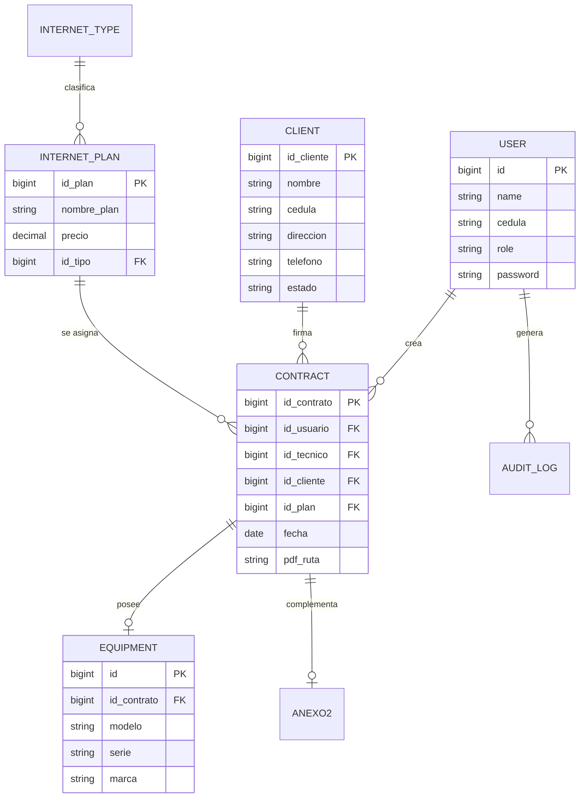

# Diseño de Base de Datos

El sistema utiliza **MySQL** como motor de base de datos relacional. A continuación se presenta el Diccionario de Datos y el Diagrama Entidad-Relación.

## 📊 Diagrama Entidad-Relación (Mermaid)

---

## 📖 Diccionario de Datos (Entidades Clave)

### 1. Tabla: `users`
Almacena al personal administrativo y técnico.
- `id`: Identificador único.
- `name`: Nombre completo.
- `cedula`: Identificación nacional (clave de acceso).
- `role`: (`administrador`, `administrativo`, `tecnico`).

### 2. Tabla: `clients`
Información de los abonados de Fibercom.
- `id_cliente`: Identificador único.
- `cedula`: Identificación nacional.
- `estado`: Estado del cliente (Activo/Inactivo).

### 3. Tabla: `contracts`
Entidad central que vincula todos los elementos.
- `id_contrato`: Identificador único.
- `id_usuario`: ID del administrativo que creó el contrato.
- `id_tecnico`: ID del técnico asignado para la instalación.
- `id_cliente`: ID del cliente asociado.
- `id_plan`: ID del plan contratado.
- `pdf_ruta`: Ruta al archivo PDF generado en el servidor.

### 4. Tabla: `equipment` (Inventario)
Equipos entregados en comodato al cliente.
- `id_contrato`: Vínculo con el contrato donde se instaló el equipo.
- `serie`: Número de serie único del equipo.
- `marca/modelo`: Especificaciones técnicas.

### 5. Tabla: `audit_logs`
Seguridad y trazabilidad.
- `user_id`: Quién realizó la acción.
- `action`: Tipo de acción (Create, Update, Delete).
- `description`: Detalle del cambio realizado.
