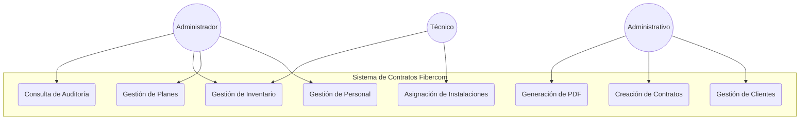
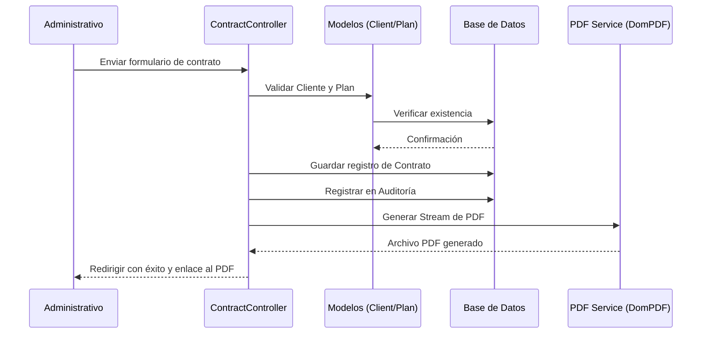
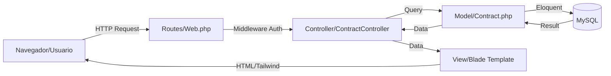

# Diagramas Técnicos (Mermaid)

Para complementar la documentación, se proponen los siguientes diagramas. Puede integrar este código directamente en archivos Markdown compatibles con GitHub, GitLab o extensiones de VSCode.

## 1. Diagrama de Casos de Uso
Define las interacciones de los diferentes roles con el sistema.

## 2. Diagrama de Secuencia: Generación de Contrato
Describe el flujo lógico para emitir un nuevo contrato legal.

## 3. Diagrama de Arquitectura MVC (Simplificado)
Visualización de las capas logic-tecnológicas de Laravel.

